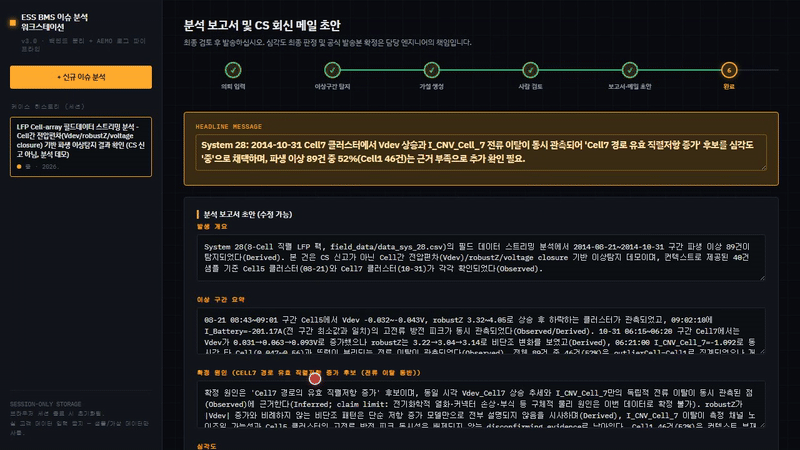

<p align="center">
  <a href="GETTING_STARTED.md">🇰🇷 한국어</a> · <strong>🇺🇸 English</strong>
</p>

<p align="center">
  <a href="../README.en.md">🔧 Already comfortable with a dev environment? Read the technical README →</a>
</p>

---

# Beginner's Guide — ESS BMS Issue Analysis Workstation

This guide walks through everything from scratch, assuming no prior coding experience. It's
fine if you've never used a terminal before.

## What is this?

Upload a battery (ESS) log file, and the AI finds unusual segments and suggests a few
candidate causes. **The AI never makes the final call** — which cause is correct and how
severe it is always gets confirmed by a human engineer at the end. When evidence conflicts,
the app does not pick a side. It makes sure the engineer sees every basis for deciding.

Your log files never leave your computer (the browser). Only a statistical summary and a
handful of sample lines are ever sent to the server — the raw file itself is never
transmitted.

## Step 1 — Install what you need

### (1) Install Node.js

- Download the **LTS version** from [nodejs.org](https://nodejs.org) and install it.
- After installing, open a terminal (Terminal app on Mac, PowerShell on Windows) and run:

  ```bash
  node --version
  ```

  If it prints a version number, you're good.

### (2) Install and log into the Claude Code CLI

This tool reuses whatever Claude subscription (Pro/Max/Team) you already have — no separate
API key or extra cost.

- macOS/Linux: `curl -fsSL https://claude.ai/install.sh | bash`
- Windows (PowerShell): `irm https://claude.ai/install.ps1 | iex`

After installing, type just `claude` in the terminal and follow the on-screen login prompt.

## Step 2 — Clone and run the project

```bash
git clone <this repository's URL>
cd ESSAnlyzer
npm install
cp .env.example .env
npm run dev
```

Once the terminal prints an address like `http://localhost:5173`, paste that into your
browser (Chrome, etc.). Seeing the app's screen means it worked.

> 💡 `npm install` can take a few minutes the first time. Just make sure you're online and
> let it finish.

## Step 3 — Run your first analysis (sample ~15 min; a large real log 30–36 min)

There's a "Load sample case" button near the top of the screen. Clicking it auto-fills
example data, so you can walk through the entire flow immediately even without a real log
file of your own.

1. Click **"샘플 케이스 불러오기" (Load sample case)** — example CS-request text gets filled in.
2. Check the checkbox below it (confirming customer name/site/personal info has been removed).
3. Click **"이상 구간 탐지 시작 →" (Start anomaly detection)** — from here, the AI needs
   time to respond. The built-in sample takes about 3–6 minutes per step, 873.6s (~14.6 min)
   across the three AI calls. A real large log takes 12–19 minutes for anomaly detection
   alone and about 30–36 minutes end-to-end. If the on-screen elapsed timer keeps climbing,
   it is thinking, not stuck (extended thinking is 87–94% of output tokens). The timeout
   default is 30 minutes.
4. Once results appear, click **"원인 가설 생성 →" (Generate hypotheses)** to move on.
5. Click one of the AI's suggested hypotheses to select it, pick a severity (high/medium/low)
   yourself, and write one line justifying it. **This step must be done by a human and cannot
   be skipped.**
6. Click **"보고서 초안 생성" (Generate report draft)** to produce a report and a CS reply
   email draft. Edit as needed, then copy and use it.

## Step 4 — Analyze a real log file

If you have your own CSV/TXT/LOG file or a ZIP archive:

1. Upload it via **"CSV/TXT/LOG 파일 추가" (Add file)** or **"ZIP 아카이브 업로드" (Upload
   ZIP archive)**.
2. Large files (hundreds of MB or more) only show up in the list at first — click
   **"분석 포함(스트리밍 시작)" (Include in analysis)** to actually start reading them. This
   is a safeguard against burning time/CPU on files you didn't mean to fully process.
3. Once a file is processed, candidate issues appear automatically. Click one to auto-fill
   the CS-request text.
4. From here on, the flow is the same as Step 3.

> ⚠️ **When using real customer data, always remove customer names, site names, and any
> personal information before uploading.** The on-screen checkbox and automatic pattern
> check help catch obvious cases, but the final responsibility is yours.

## 🎬 Demo video — analyzing the Darmstadt (Case B) battery field dataset

Upload → anomaly detection → hypothesis generation → human review → report draft against
the public LFP field dataset. Gold Case B really takes about 29–36 minutes; the clip below
has waits cut.

<p align="center">
  
</p>

▶️ [Watch the full demo (MP4, 38s edit — real elapsed ~29–36 min, waits compressed)](assets/demo-case-b.mp4)

## FAQ

**Q. I get an error like "claude: command not found."**
A. Either the Claude Code CLI isn't installed, or your terminal hasn't picked up the updated
PATH yet. Try closing the terminal completely and reopening it.

**Q. The AI response is taking a really long time (2-3+ minutes).**
A. That's expected. Even the built-in sample takes 214–341 seconds per step (~15 min
combined). A large LFP log has been measured at 12–19 minutes for anomaly detection,
~9 minutes for hypotheses, and ~8 minutes for the report draft. If the elapsed-time
counter keeps climbing, it is extended thinking, not a freeze. The timeout default is
30 minutes.

**Q. Some files inside my uploaded ZIP show "읽기 실패" (read failed).**
A. Only that one file has a problem — the rest continue processing normally. The original
file might genuinely be corrupted; try extracting it a different way to check.

**Q. How do I share results with someone else?**
A. Case history is only kept in the browser session and disappears on reload. Use the copy
buttons on screen to copy the report/email draft into your internal documents or email.

## Want to go deeper?

If you're curious how this tool works under the hood (architecture, log-format detection
logic, AI prompt design, etc.), check the [technical README](../README.en.md).
